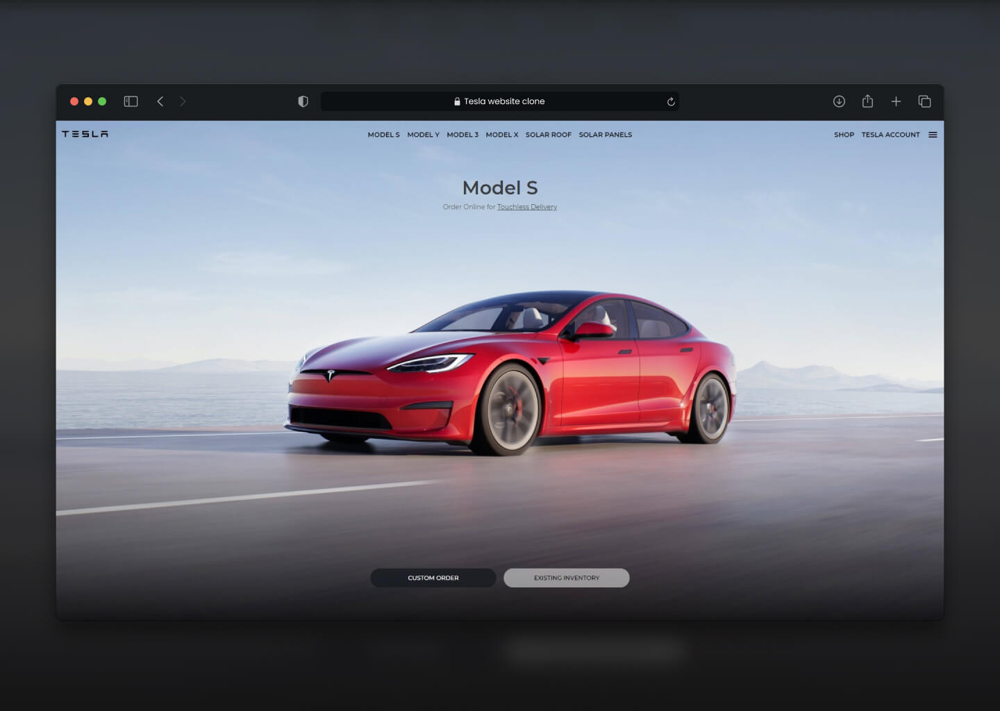

# Netflix Website Clone using React

> Simple Tesla website clone created with HTML, CSS & JS.

> Live demo [https://jakubparlej.github.io/tesla-website-clone/](https://jakubparlej.github.io/tesla-website-clone/).

## Table of Contents

- [General info](#general-info)
- [Technologies](#technologies)
- [Setup](#setup)

## Technologies

Project is created with:

- HTML
- CSS
- JS

## Features

- Navigation bar with netflix logo and user icon
- Banner with random trending movie background, name and description
- Movies categories with thumbnail sliders

## Acknowledgements

This project was based on [Tesla.com](https://www.tesla.com)

## Contact

Created by [@jakubparlej](https://jprojects.pl) - feel free to contact me!
